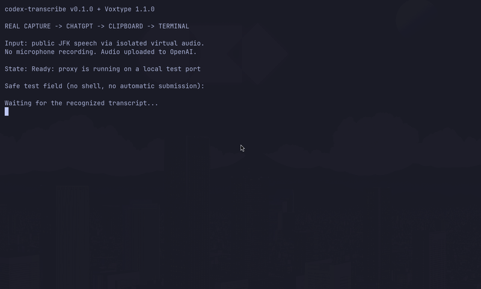

# Real Voxtype integration demo

This is a capture of an **actual integration run**, not a product mockup. The terminal is an isolated test field showing progress and receiving the real pasted text; it is not a UI bundled with codex-transcribe.

## What was exercised

1. A version-injected Linux x86-64 binary, extracted from the v0.1.0 release-format archive, served transcription on a local test port.
2. Voxtype 1.1.0 recorded a public JFK speech sample through a dedicated virtual PipeWire/ALSA input. No microphone or unrelated desktop audio was recorded.
3. Voxtype uploaded its captured WAV to the proxy, which used the existing Codex ChatGPT login to request transcription.
4. Voxtype's built-in paste output inserted the real recognized transcript into the test field with Ctrl+Shift+V. Automatic submission was disabled.
5. The inserted text was compared with the actual clipboard result and matched.

The observed transcript was:

> And so, my fellow Americans, ask not what your country can do for you; ask what you can do for your country.

The input sample came from [OpenAI Whisper's public test fixture](https://github.com/openai/whisper/blob/main/tests/jfk.flac). The GIF has no audio and uses sampled screen frames; it is intended to show the workflow, not benchmark latency. Only the isolated terminal region was captured.

## Try it yourself

Follow the [release download and first request](../README.md#quick-start-no-go-toolchain-required), then the [verified Voxtype recipe](voxtype.md). Use an audio file or spoken sentence that you consent to uploading. For public sample testing, download the linked fixture and convert it to 16 kHz mono PCM16 WAV with ffmpeg before using `voxtype transcribe`.

## Boundaries

- Voxtype owns recording and desktop insertion; codex-transcribe owns the transcription HTTP endpoint.
- The ChatGPT endpoint is private and unofficial. Audio is uploaded to OpenAI; access, retention, and availability are controlled upstream.
- The demonstrated desktop environment is Linux x86-64 with Hyprland/Wayland and PipeWire. This is not evidence that insertion works on every app or compositor.
- No custom review UI, client-facing streaming, or auto-submit feature is provided by the proxy.
- The demo does not establish recognition quality across microphones, languages, or audio formats. Direct Ogg/Opus remains an [open investigation](https://github.com/DaDecky/codex-transcribe/issues/1).
